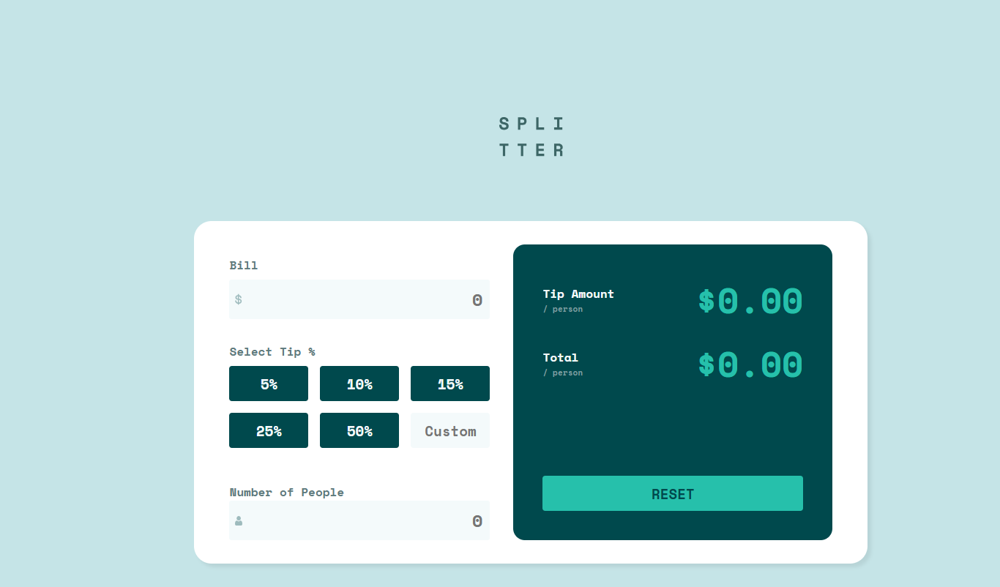
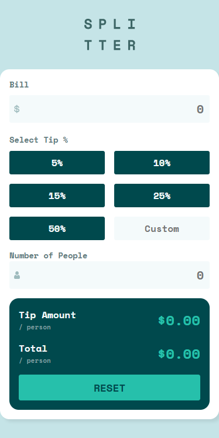

## 💰 Tip Calculator App


A sleek, responsive tip calculator built as part of the Frontend Mentor challenge. This project helped me strengthen my understanding of DOM manipulation, form validation, and dynamic UI updates using vanilla JavaScript.

## 🛰 Live Demo  
🔗 [View Project](https://bhavikthakur.github.io/tip-calculator/)  

## 📸 Preview  
  
   

## 📌 Features  
 💸 Calculates tip amount and total per person in real-time <br>
 🧠 Smart input validation (e.g. zero people, non-numeric inputs) <br>
 🧮 Custom tip input along with quick-select percentages <br>
 🌈 Clean, responsive layout styled with CSS and media queries <br>
 ♿️ Basic accessibility practices in place

## 🛠️ Built With  
- HTML5 – Semantic structure and forms.   <br>
- CSS3 – Custom styling with utility-first approach.  <br>
- JavaScript – Dynamic calculations and form validation.    <br>
- Google Fonts – Space Mono for a modern monospaced look.

## 📂 Folder Structure  
/project-folder <br>
│── /css <br>
│   ├── reset.css        # Resets default browser styles <br>
|   |-- common.css       # common values <br>
│   ├── styles.css       # Main styling file <br>
│   ├── media-queries.css # Responsive styles <br>
│── /images             # Contains all images & icons <br>
│── index.html          # Main HTML file <br>
|-- app.js              # main Js file <br>
│── README.md           # Documentation <br>


## 🔧 Setup & Usage  
1. Clone this repository:  
   ```bash
   git clone https://github.com/YOUR_GITHUB_USERNAME/social-links-profile.git    
2. Open index.html in your browser. 

## 🔓 Lessons Learned  
DOM Traversal and Event Handling <br>

Dynamic input sanitization and formatting <br>

Real-world form validation logic <br>

Creating reusable button components with JavaScript <br>

Designing for responsiveness from scratch


## 🤝 Connect With Me  
👨‍💻 GitHub: [bhavikthakur](https://github.com/bhavikthakur)  <br>
💼 LinkedIn: [Bhavik Thakur](https://www.linkedin.com/in/bhavik-thakur/)  <br>
🐦 Twitter: [Bhavik Thakur](https://x.com/BhavikkThakur)  <br>
